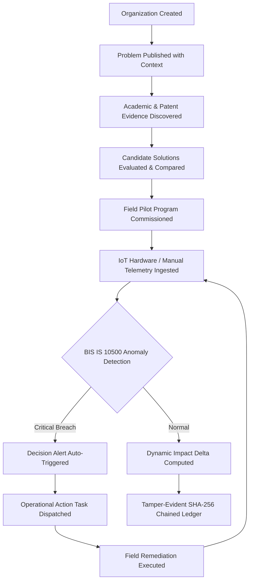

# 🏢 InnovateIQ — Production SaaS Product Workflow & Architecture Guide

## Overview

InnovateIQ is a multi-tenant enterprise Innovation Intelligence SaaS platform designed for government departments, research universities, industry partners, and community organizations.

It establishes an unbroken, data-grounded pipeline:
$$\text{Organization} \rightarrow \text{Problem} \rightarrow \text{Evidence} \rightarrow \text{Solution Evaluation} \rightarrow \text{Pilot Deployment} \rightarrow \text{Telemetry Ingestion} \rightarrow \text{Anomaly Detection} \rightarrow \text{Action Dispatch} \rightarrow \text{Dynamic Impact} \rightarrow \text{Audit Ledger}$$

---

## 1. End-to-End Enterprise Workflow

### Phase 1: Multi-Tenant Organization & Problem Publication
1. An administrative user registers a tenant organization (`POST /api/organizations`), such as the *Tamil Nadu Water Supply and Drainage Board (TWAD)* or *IIT Madras Clean Water Initiative*.
2. The organization publishes empirical problems (`POST /api/problems`) with location coordinates, affected demographics, priority levels, and target populations.

### Phase 2: Evidence Synthesis & Solution Trade-offs
3. The platform searches academic and patent connectors (`GET /api/evidence/search`) across OpenAlex, arXiv, PubMed, and patent databases.
4. Engineers submit candidate technologies (`POST /api/solutions`).
5. The comparison engine (`POST /api/solutions/compare`) evaluates technical maturity (TRL 1–9), unit economics, capital feasibility, and operational risk.

### Phase 3: Field Pilot & Telemetry Stream Ingestion
6. An operational pilot testbed is deployed (`POST /api/pilots`), linking to hardware sensor nodes (`POST /api/telemetry/devices`).
7. Edge devices (ESP32/cellular nodes) or field technicians submit water quality readings (`POST /api/telemetry` with `PHYSICAL_SENSOR` or `MANUAL_ENTRY`).
8. The backend evaluates readings against **BIS IS 10500:2012 Drinking Water Specification**.

### Phase 4: Autonomous Anomaly Detection & Action Dispatch
9. When a critical limit is breached (e.g. Turbidity $> 5.0\text{ NTU}$ or pH out of $6.5-8.5$), the system:
   - Sets the telemetry evaluation status to `CRITICAL`.
   - Auto-creates a `DecisionAlert` (`GET /api/alerts`).
   - Dispatches a prioritized `OperationalAction` (`POST /api/actions`) to field operators.
10. Operators perform maintenance, backwash, or filter replacement and resolve the task with resolution notes (`PATCH /api/actions/:id`).

### Phase 5: Dynamic Traceable Impact & Cryptographic Governance
11. The dynamic impact calculation engine (`GET /api/impact/calculate/:pilotId`) compares the initial baseline telemetry with post-action readings:
    - Calculates mathematical percentage improvement: $\Delta = \frac{\text{Current} - \text{Baseline}}{\text{Baseline}} \times 100$.
    - Assigns a statistical confidence score grounded in sample size and time window.
    - Emits explicit "Insufficient Field Data" states if fewer than 3 verified readings exist.
12. Every state transition and inference is hashed with SHA-256 and chained into an immutable ledger verified via `GET /api/audit/verify-chain`.

---

## 2. Multi-Tenant Data Schema & Isolation

All production tables include `organization_id` foreign keys and `is_demo` boolean flags:

| Entity | Primary Key | Multi-Tenant Foreign Key | Purpose |
| :--- | :--- | :--- | :--- |
| `organizations` | `id` (`org-xxx`) | — | Multi-tenant customer accounts & subscription tiers |
| `problems` | `id` (`prob-xxx`) | `organization_id` | Field challenges with target populations |
| `solutions` | `id` (`sol-xxx`) | `organization_id`, `problem_id` | Engineering candidate architectures & TRL scores |
| `pilots` | `id` (`pilot-xxx`) | `organization_id`, `problem_id` | Operational field trial deployments |
| `devices` | `device_id` | `pilot_id` | IoT sensor hardware metadata & battery/status |
| `telemetry` | `id` (`packet-xxx`) | `pilot_id`, `device_id` | Indexed time-series sensor readings |
| `operational_actions`| `id` (`act-xxx`) | `pilot_id`, `problem_id` | Dispatchable intervention & remediation tasks |
| `decision_alerts` | `id` (`alt-xxx`) | `pilot_id`, `problem_id` | Critical threshold breach warnings |
| `audit_logs` | `id` (`aud-xxx`) | `organization_id` | SHA-256 chained tamper-evident governance ledger |

---

## 3. Judge Evaluation Demo Mode Isolation

The 14-stage Judge Evaluation Demo operates under strict isolation:
- All demo records are tagged with `is_demo: true`.
- Calling `POST /api/demo/reset` only wipes `is_demo: true` records.
- Production organizations, field telemetry, and audit history (`is_demo: false`) remain 100% untouched and persistent.
